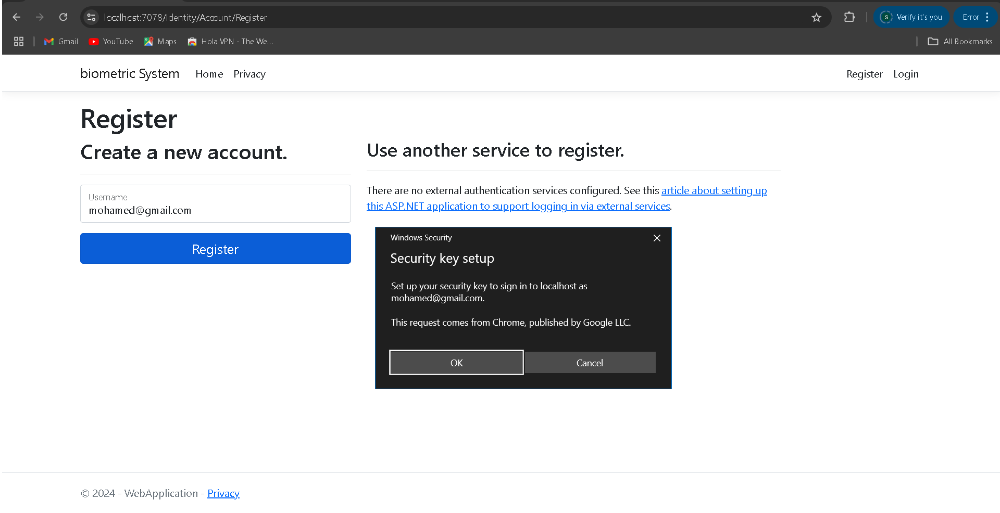
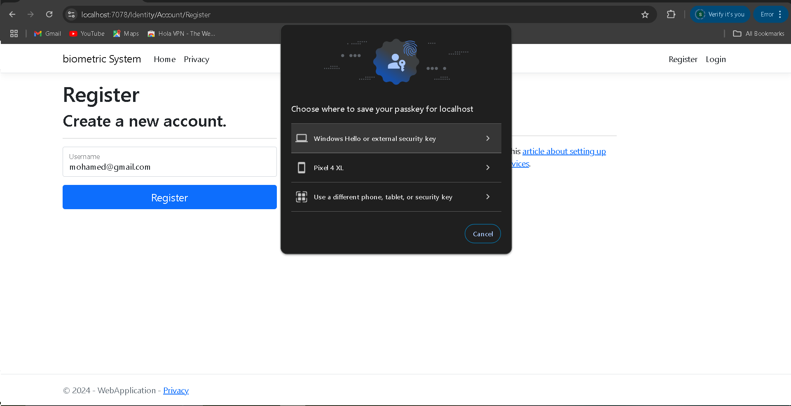
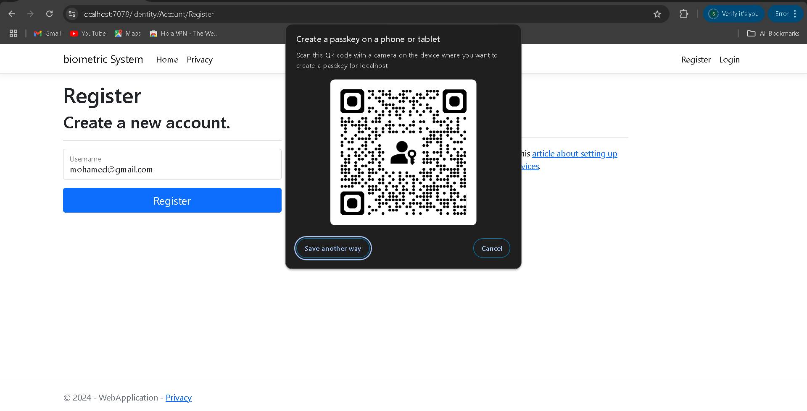
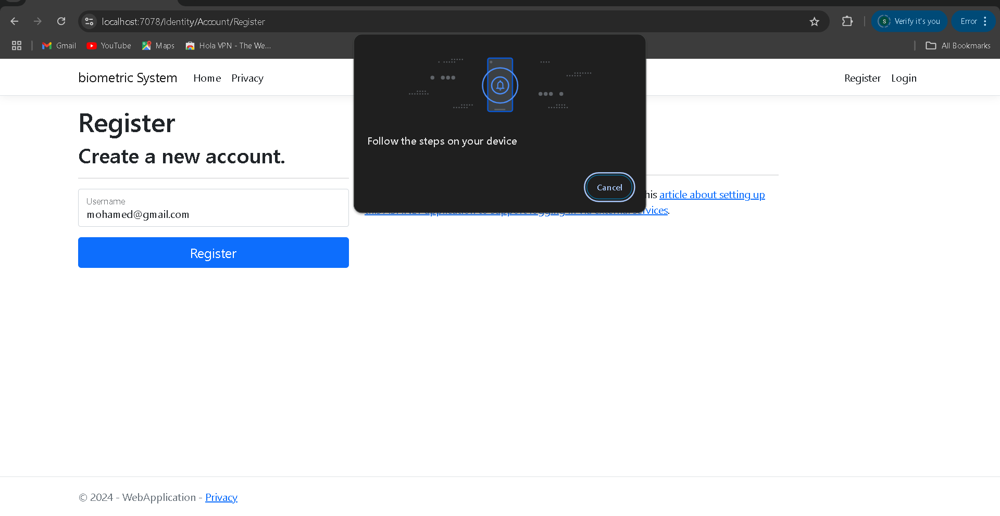
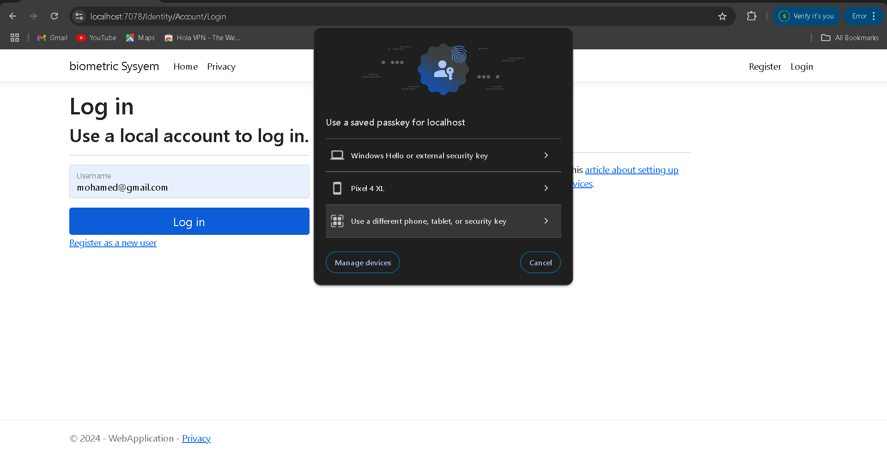
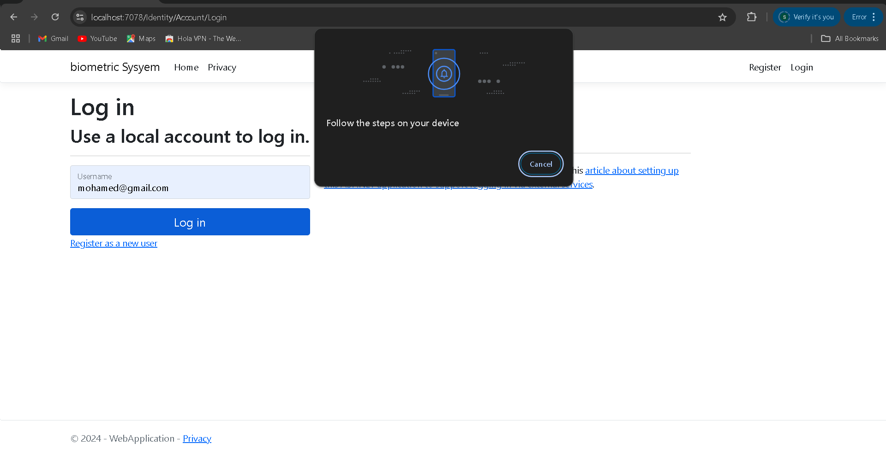
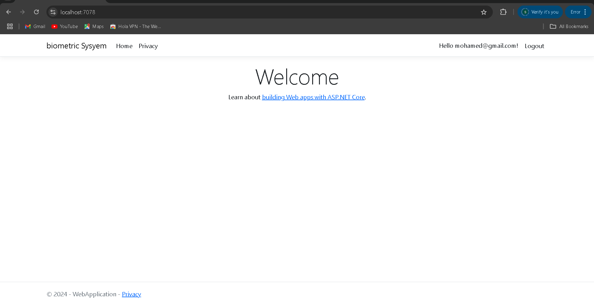

# 🛡️ FIDO2 Passwordless Authentication

## Tech stack 🧑‍💻 💻

* Dotnet core MVC (.Net 8)
* MS SQLServer (Database)
* Entity Framework Core (ORM)
* Identity Core (Authentication)
* FIDO2 / WebAuthn (Biometric Security)
* Bootstrap 5 (Frontend)

---

## 🔐 Biometric Security System

This is a modern web application demonstrating how to completely eliminate passwords using FIDO2 and WebAuthn. 
It allows users to register and log in securely using their device's native biometric sensors (Fingerprint, Windows Hello, FaceID) or hardware security keys.

---

## 🚀 Features

* 🛡️ **Zero Passwords:** Secure, phishing-resistant authentication.
* 👤 **Biometric Registration:** Seamless device mapping to user accounts.
* 🔑 **Instant Login:** Frictionless entry in milliseconds.
* ⚙️ **Modern Architecture:** Clean integration with ASP.NET Core Identity.
* 📱 **Responsive Design:** Clean and accessible UI.

---

## 📸 Screenshots

### 🛠️ Registration Flow (6 Steps)

🖥️ **Step 1: Start Registration**
> User enters their username to initiate the process.

🖥️ **Step 2: Setup Request**
> System prepares the biometric setup.

🖥️ **Step 3: Biometric Prompt**
> Device sensor (Fingerprint/Face) is activated by the browser.

🖥️ **Step 4: Verification**
> Validating the biometric cryptographic key.

🖥️ **Step 5: Redirect to Home**
> User is fully registered and active on the Home page.

---

### 🔐 Login Flow (3 Steps)

🖥️ **Step 1: Login Request**
> User enters their username to log in.

🖥️ **Step 2: Biometric Scan**
> FIDO2 prompt asks for fingerprint/face verification.

🖥️ **Step 3: Welcome Back**
> Immediate access granted to the Dashboard.

